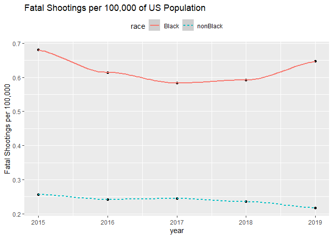

Police Shooting and Black Lives Matter Protest Analysis
=======================================================

The purpose of this module is to support the interdisciplinary goal with
police shooting data. This analysis calls attention to the ongoing
social unrest resulting from a series of deadly shootings.

What is the Per Capita Death Rate Among Blacks and Non-Blacks Due to Police Shootings?
--------------------------------------------------------------------------------------

The fatal police shooting data was downloaded from the data.world
platform located
[here](https://data.world/data-society/fatal-police-shootings).  
The following are the key variables of interests:  
data - imported as a character race -

First we will download the data and convert it to a tibble data frame
type. Then we examine the data.

    #download.file("https://raw.githubusercontent.com/washingtonpost/data-police-shootings/master/fatal-police-shootings-data.csv", "police.csv")
    df <- tibble(read.csv("police.csv"))
    dim(df)

    ## [1] 5424   14

    str(df)

    ## tibble [5,424 x 14] (S3: tbl_df/tbl/data.frame)
    ##  $ id                     : int [1:5424] 3 4 5 8 9 11 13 15 16 17 ...
    ##  $ name                   : chr [1:5424] "Tim Elliot" "Lewis Lee Lembke" "John Paul Quintero" "Matthew Hoffman" ...
    ##  $ date                   : chr [1:5424] "2015-01-02" "2015-01-02" "2015-01-03" "2015-01-04" ...
    ##  $ manner_of_death        : chr [1:5424] "shot" "shot" "shot and Tasered" "shot" ...
    ##  $ armed                  : chr [1:5424] "gun" "gun" "unarmed" "toy weapon" ...
    ##  $ age                    : int [1:5424] 53 47 23 32 39 18 22 35 34 47 ...
    ##  $ gender                 : chr [1:5424] "M" "M" "M" "M" ...
    ##  $ race                   : chr [1:5424] "A" "W" "H" "W" ...
    ##  $ city                   : chr [1:5424] "Shelton" "Aloha" "Wichita" "San Francisco" ...
    ##  $ state                  : chr [1:5424] "WA" "OR" "KS" "CA" ...
    ##  $ signs_of_mental_illness: chr [1:5424] "true" "false" "false" "true" ...
    ##  $ threat_level           : chr [1:5424] "attack" "attack" "other" "attack" ...
    ##  $ flee                   : chr [1:5424] "Not fleeing" "Not fleeing" "Not fleeing" "Not fleeing" ...
    ##  $ body_camera            : chr [1:5424] "false" "false" "false" "false" ...

    range(df$date)

    ## [1] "2015-01-02" "2020-06-19"

The data table contains 5,424 shooting from 2015 to 2020. Now we must
prepare the data in order to examine the amount of fatal police
shootings. First we convert the date variable from a character format to
a date format, extract the year and store in a new column, and convert
all rows without the label “B” for black to the category “nonBlack.”
This will allow us to compare black shootings with non-black shootings.
Additionally, we filter out the missing values in the race variable and
the year 2020. Since every observation is one fatal shooting, we group
the data by year and count the observations into a new table called
“yearlyshootings.”

    df <- mutate(df, date = as.Date(date),year = year(date), Race = if_else(race == "B", "Black", "nonBlack")) %>%
            filter(year != 2020, !race =="")
    group <- group_by(df, year, Race)
    yearlyshootings <- tibble(summarize(group, shootings =n()))

    ## `summarise()` regrouping output by 'year' (override with `.groups` argument)

Now we visualize our data.

    g <- ggplot(yearlyshootings,aes(x = year, y = shootings)) + 
            geom_point() + 
            geom_smooth(aes(linetype = Race, color = Race)) +
            theme(legend.position = "top")
    suppressWarnings(print(g))

    ## `geom_smooth()` using method = 'loess' and formula 'y ~ x'

The above chart shows the total number of fatal police shootings for
blacks and non-black victims. To better understand the relative
comparison between these two categories, we now calculate the per capita
values. We first need to get data on populations. We acquired the US
population data
[here](https://www.kff.org/other/state-indicator/distribution-by-raceethnicity/?dataView=1&activeTab=graph&currentTimeframe=0&startTimeframe=3&selectedDistributions=black--total&selectedRows=%7B%22wrapups%22:%7B%22united-states%22:%7B%7D%7D%7D&sortModel=%7B%22colId%22:%22Location%22,%22sort%22:%22asc%22%7D).
This data only went up to 2018 and assume that the 2019 census data
equals 2018. The differences between census populations each year is
minimal, therefore, we expect that this assumption is valid. Here we
read in the data and look at what it looks like.

    pop <- read.csv("pop.csv")
    head(pop)

    ##   year  race       pop
    ## 1 2015 Black  37923800
    ## 2 2015 Total 312777900
    ## 3 2016 Black  38081700
    ## 4 2016 Total 314466400
    ## 5 2017 Black  38408000
    ## 6 2017 Total 317022500

The data has the total US population and black populations. In order to
obtain the non-black population, we widen the data table, subtract the
black populations from the total, and lengthen back the data table.

    pop <- pivot_wider(pop, names_from = race, values_from = pop) %>%
            mutate(nonBlack = Total - Black) %>%
            pivot_longer(cols = c("Black", "nonBlack"), names_to = "race", values_to = "pop")

In order to combine both data sets, we first create key values based on
teh year and race columns and perform an inner joing by this key value.

    pop <- mutate(pop, key = paste0(year, race))
    yearlyshootings <- mutate(yearlyshootings, key = paste0(year, Race))
    finaldf <- inner_join(yearlyshootings, pop, by = "key") %>%
            select(year = year.x, race, shootings, pop) %>%
            mutate(perCapita = shootings/pop*1000000)
    head(finaldf)

    ## # A tibble: 6 x 5
    ##    year race     shootings       pop perCapita
    ##   <dbl> <chr>        <int>     <int>     <dbl>
    ## 1  2015 Black          258  37923800      6.80
    ## 2  2015 nonBlack       707 274854100      2.57
    ## 3  2016 Black          234  38081700      6.14
    ## 4  2016 nonBlack       670 276384700      2.42
    ## 5  2017 Black          224  38408000      5.83
    ## 6  2017 nonBlack       682 278614500      2.45

Next we visualize our data.

    p <- ggplot(finaldf, aes(x = year, y = perCapita)) + 
            geom_point() + 
            geom_smooth(aes(linetype = race, color = race)) +
            theme(legend.position = "top") +
            labs(title = "Fatal Shootings per 1 Million of US Population", y = "Deaths per 1 Million")
    suppressWarnings(print(p))

    ## `geom_smooth()` using method = 'loess' and formula 'y ~ x'

The above chart shows that teh black fatal shootings per 1 million is
significantly more than non-balck fatal shootings.

Are Black Poverty Rates Higher Than White Poverty Rates in the US?.
-------------------------------------------------------------------

We will now perform a t test to understand if there is a statistical
difference between the white and black US poverty rates. We obtained the
data from [this
website](https://dataverse.harvard.edu/dataset.xhtml?persistentId=doi:10.7910/DVN/L2GSK6),
the replication data for the article title “Black Lives Matter: Evidence
that Police-Caused Deaths Predict Protest.” The codebook and supporting
r scripts are also found here that were developed to write the article.
The article can be found
[here](https://www.cambridge.org/core/services/aop-cambridge-core/content/view/BFA2E74F4BCB25C3C222807E8B1111D4/S1537592717004273a.pdf/div-class-title-black-lives-matter-evidence-that-police-caused-deaths-predict-protest-activity-div.pdf).

Each observation in this data set is for a city designated by a combined
state and locality FIPS code. The purpose of the analysis was to gain a
better understanding between police violence and protest activity. The
primary variable of interest is the total Black Lives Matter (BLM)
protests recorded between 8/9/14 and 8/9/15 for each city. The datasets
used to create the tidy dataset for the analysis came from the
following, categorized by opportunity structures:  
**Resource opportunity structure:**  
1. The 2014 American Community Survey that contains locality-level
measures of population, population density, percentage black, and black
poverty levels.  
**Political opportunity structure:**  
2. NAACP Activity that contains the history of Black political
organizing in an area and serves as an (imperfect) proxy for a tradition
of Black political activity. The variable indicates the number of years
a locality had a local NAACP branch during this early period of the
organization’s activism.  
3. Mayoral Data that contains dummy variables for a black mayor and
Republican mayor.  
4. City Level Partisanship. Contains the Democratic vote share of the
2008 presidential election.  
**Education opportunity structure:**  
5. College education. contains the percent of population with a
bachelor’s degree or above, the total enrolment of colleges in a
locality / total population.  
**Police Caused Deaths**  
6. Data from 1/1/2013-08/09/2014 and 8/10/2014-8/10/2015  
**Crime**  
7. A crime dummy indicator for being listed in the top 100 highest
violent crime cities in 2015.

    BLM <- tibble(read.csv("BLM_cities.csv"))

To perform our comparison we extract the white and black poverty rates,
create a new data table and lengthen it to allow us to build a boxplot.

    wpoverty <- BLM$WhitePovertyRate
    bpoverty <- BLM$BlackPovertyRate
    pov <- tibble(white = wpoverty, black = bpoverty)
    povlong <- pivot_longer(pov, cols = c("white", "black"), names_to = "race", values_to = "poverty")
    head(povlong)

    ## # A tibble: 6 x 2
    ##   race  poverty
    ##   <chr>   <dbl>
    ## 1 white     5.4
    ## 2 black    11.6
    ## 3 white    12.1
    ## 4 black    24.5
    ## 5 white    30.8
    ## 6 black    38.6

Next we visualize the box plot.

    ggplot(povlong, aes(x = race, y = poverty)) +
            geom_boxplot() +
            labs(title = "Black and White Poverty Rate of US City Localities", y= "Poverty Rate of city localities")

The black poverty rate median is much higher that the white poverty rate
median. In order to confirm there is a statistical significance between
rates we now perform a Welch two sample t-test. In the test, our null
hypothesis is that the means of both poverty rates are zero. Each
observation in this data table is a city’s white and poverty rates.

    t.test(pov$black, pov$white)

    ## 
    ##  Welch Two Sample t-test
    ## 
    ## data:  pov$black and pov$white
    ## t = 30.587, df = 2008.4, p-value < 2.2e-16
    ## alternative hypothesis: true difference in means is not equal to 0
    ## 95 percent confidence interval:
    ##  12.05010 13.70118
    ## sample estimates:
    ## mean of x mean of y 
    ##  24.16306  11.28742

The p-value is significantly lower than the 0.05 significance level.
Therefore, we reject the null hypothesis and conclude that there is a
significant difference between the white and black poverty rates. The
mean black poverty rate of all US cities is

    mean(pov$black)

    ## [1] 24.16306

while the mean white poverty rate of all US cities is

    mean(pov$white)

    ## [1] 11.28742

What Variables Predict the Frequency of Black Lives Matter (BLM) Protests?
--------------------------------------------------------------------------

First we will examine the variables related to the resource, political,
and educational opportunity structures. We will examine each variable
against the total number of BLM protests. To do this we first write
functions for the correlation, a linear plot, a linear regression model
fit summary, and the diagnostics plots for the fit.

    protests <- BLM$tot.protests
    protestCor <- function(x) {
            cor(protests, x)
    } 
    protestPlot <- function(x, title) {
            ggplot(data = BLM, aes(x = x, y = tot.protests)) +
                    geom_point() +
                    geom_smooth(method = lm) +
                    labs(title = title)
    }

We will start with the resource opportunity structure variable ralated
to the black poverty rate.

    poverty <- BLM$BlackPovertyRate
    protestCor(poverty)

    ## [1] 0.108112

    protestPlot(poverty, "Black Poverty Rate (x) vs Total BLM Protests")

    ## `geom_smooth()` using formula 'y ~ x'

Although there are data points that have a high number of protests with
higher black poverty rates, the data does not show any trend that is of
significance as a single variable.

Now we will look at the political opportunity structure.

    pol <- BLM$NAACPyears
    protestCor(pol)

    ## [1] 0.4823707

    protestPlot(pol, "Number of years a locality had a local NAACP branch (x) vs Total BLM Protests")

    ## `geom_smooth()` using formula 'y ~ x'

The NAACP variable is an (imperfect) proxy for a tradition of Black
political activity in a city. This variable has a higher correlation and
does show a linear trend. Therefore, we now will fit a linear model and
check for the diagnostics.

    fit <- lm(tot.protests ~ pol, data = BLM)
    summary(fit)

    ## 
    ## Call:
    ## lm(formula = tot.protests ~ pol, data = BLM)
    ## 
    ## Residuals:
    ##    Min     1Q Median     3Q    Max 
    ## -7.196  0.015  0.015  0.015 34.440 
    ## 
    ## Coefficients:
    ##             Estimate Std. Error t value Pr(>|t|)    
    ## (Intercept) -0.01489    0.06499  -0.229    0.819    
    ## pol          0.28843    0.01422  20.285   <2e-16 ***
    ## ---
    ## Signif. codes:  0 '***' 0.001 '**' 0.01 '*' 0.05 '.' 0.1 ' ' 1
    ## 
    ## Residual standard error: 2.209 on 1357 degrees of freedom
    ## Multiple R-squared:  0.2327, Adjusted R-squared:  0.2321 
    ## F-statistic: 411.5 on 1 and 1357 DF,  p-value: < 2.2e-16

The coefficient of the NAACP variable x, is statistically significant.
However, this single variable only explains 23% of the variation.

    par(mfrow = c(2,2))
    plot(fit)

The Residuals vs Fitted chart is a scatterplot between the residuals and
predicted values and should look random; for this model, they do not. As
the fitted values along the x axis increase, the variance of the
residuals increases.

The second plot is a normal Q-Q or a normal probability plot. If the
errors are distributed normally, we should see a straight lines; for
this model we do not.

The third plot should have a relatively straight red line but this model
clearly does not.

The last plot calculates the cook’s distance for each point and
highlights which point have the highest leverage or influence on the
model fit.

These diagnostics indicate that the residual errors do not have equal
variance and are not normally distributed. Therefore, we cannot
effectively interpret the coefficient of the model fit.

Our last opportunity structure we will examine is the education
variable. This variable is the total enrolment of colleges in a locality
/ total population.

    ed <- BLM$collegeenrollpc
    protestCor(ed)

    ## [1] 0.07240007

    protestPlot(ed, "Total enrolment of colleges in a locality / total population (x) vs Total BLM Protests")

    ## `geom_smooth()` using formula 'y ~ x'

Although the plot does not show a trend and the correlation between this
education variable and the number of protest is very low, all of the
higher values of protest are concentrated on the lower end of the
x-axis. This provides some indication that the cities will low
enrollment in college have a higher number of protests.

Conclusion
==========

The analysis of single variable regression among the opportunity
structures did not reveal any compelling evidence. The primary reason
for this is that the outcome of interest is count data. The total BLM
protest can be considered as a rate or frequency. This implies that
there are other methods within the generalized linear models methods
that could be used to analyze this data. In fact, the author of the
article this data supported used a form of Poisson regression modeling
call the negative binomial. There are many methods available to analyze
data. In this exercise, we learned how to examine data, fit models, and
diagnose their fit.
